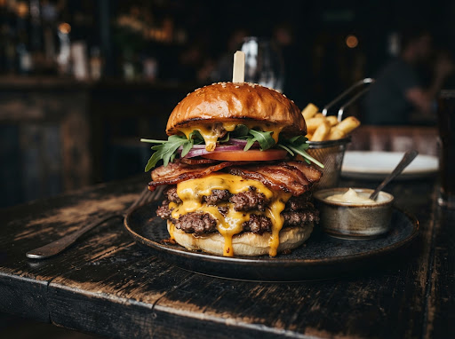

# 🍔 BurguerSync Ourinhos — Real-Time Delivery & Kitchen Kanban

<div align="center">



[](https://antigravity.google)
[](https://stitch.withgoogle.com)
[](https://firebase.google.com)
[](https://sp.senai.br)
[](https://nodejs.org)
[](https://opensource.org/licenses/MIT)

**[🇧🇷 Português](#-sobre-o-projeto-pt-br)** • **[🇺🇸 English](#-about-the-project-en)**

</div>

---

## 🇧🇷 Sobre o Projeto (PT-BR)

O **BurguerSync Ourinhos** é uma aplicação web full-stack de ponta a ponta com sincronização reativa em tempo real. Desenvolvida para eliminar a perda de comandas de papel e unificar o ciclo entre a experiência de compra do cliente e a linha de produção dos chapeiros na cozinha.

O projeto foi concebido e acelerado através da plataforma **Google Antigravity**, integrando prototipagem de alta fidelidade via **Google Stitch MCP** e banco de dados NoSQL serverless **Firebase Cloud Firestore**.

### 🌟 Destaques e Funcionalidades

- **🛍️ Visão do Cliente:** Vitrine fluida de lanches artesanais, gaveta expansível de carrinho, cálculo automático de subtotal e taxa de entrega fixa de Ourinhos (**R$ 5,00**), validação estrita de formulário (exigindo **DDD 14**) e checkout dinâmico via Pix Copia-e-Cola e QR Code.
- **👨‍🍳 Visão da Cozinha (Kanban em Tempo Real):** Monitor reativo ouvindo eventos do Firestore com `onSnapshot`, alertas sonoros de novos pedidos (Buzzer de chapa), cartões informativos com destaque para observações de ingredientes e botões de transição ergonômica de status:
  - 🔵 **Recebido** (`#00D4FF`)
  - 🟡 **Em Preparo / Na Chapa** (`#FFB800`)
  - 🟠 **Saiu para Entrega** (`#FF9000`)
  - 🟢 **Entregue** (`#04D361`)
- **🛡️ Resiliência & Self-Annealing:** Mecanismo de persistência local em caso de instabilidade na nuvem e reconexão automática resiliente.

### 🤖 Agentes de IA e Skill Packs Empregados

- **Google Antigravity Orchestrator (Layer 2):** Orquestração autônoma do ciclo de vida, decomposição de tarefas e garantia de alinhamento com os SOPs da Layer 1.
- **Stitch MCP (Google Stitch Integration):** Extração de tokens de design, layout semântico e fotografia gastronômica de alta definição.
- **Firebase MCP / Firestore SDK v10:** Persistência reativa na nuvem com validação de schemas de dados.
- **Validador Determinístico Layer 3:** Automação em Node.js para sanitização de dados cadastrais e conferência de integridade de pedidos.

### 🛠️ Estrutura de Diretórios

```text
├── .env                     # Chaves de API e credenciais seguras
├── .tmp/                    # Buffers de schema e validações transitórias
├── assets/imagens/          # Imagens otimizadas (Smash, Bacon, Batata)
├── backend/                 # Regras do Firestore e servidor local
├── directives/              # SOPs e manuais estratégicos (Layer 1)
├── documentation/           # Diagramas de arquitetura e promptHistory.md
├── execution/               # Scripts determinísticos de validação (Layer 3)
├── frontend/                # Módulos espelhados da interface web
├── src/                     # Código ES6 modular (cliente, cozinha, firebase)
├── index.html               # Aplicação web unificada
├── style.css                # Design System Dark Mode com neons
├── executar.bat             # Inicializador em lote no Windows
└── README.md                # Documentação técnica mestre bilíngue
```

### ⚡ Como Executar Localmente

1. Clone o repositório ou navegue até o diretório do projeto:
   ```bash
   cd pc-senai/aula07-projeto1-burguersync
   ```
2. Instale as dependências:
   ```bash
   npm install
   ```
3. Inicie o servidor local:
   ```bash
   npm start
   ```
   *(Ou execute `executar.bat` no Windows)*
4. Abra seu navegador em `http://localhost:3000`

---

## 🇺🇸 About the Project (EN)

**BurguerSync Ourinhos** is an end-to-end full-stack web application featuring real-time reactive synchronization. Designed to eliminate lost paper tickets and unify the workflow between the customer ordering experience and the kitchen grill team.

The project was architected and accelerated via **Google Antigravity**, integrating high-fidelity design generation through **Google Stitch MCP** and serverless NoSQL data persistence via **Firebase Cloud Firestore**.

### 🌟 Key Features

- **🛍️ Customer View:** Sleek gourmet burger catalog, responsive drawer cart, automated delivery fee calculation (fixed **R$ 5.00** for Ourinhos), strict form validation (requiring regional **area code 14**), and dynamic instant Pix copy-and-paste checkout.
- **👨‍🍳 Real-Time Kitchen Kanban:** Reactive monitor listening to Firestore changes via `onSnapshot`, Web Audio buzzer alerts for incoming orders, prominent ingredient customizations highlighting, and tactile operational status pills:
  - 🔵 **Received** (`#00D4FF`)
  - 🟡 **In Prep / On Grill** (`#FFB800`)
  - 🟠 **Out for Delivery** (`#FF9000`)
  - 🟢 **Delivered** (`#04D361`)
- **🛡️ Resilience & Self-Annealing:** Local fallback caching during connection drops and automated WebSocket reconnect handlers.

### 🤖 AI Agents & Skill Packs Used

- **Google Antigravity Orchestrator (Layer 2):** Autonomous lifecycle coordination and strategic directives adherence.
- **Google Stitch MCP Server:** Design token harmonization and culinary photography assets.
- **Firebase MCP / Firestore SDK v10:** Reactive cloud events and schema-validated persistence.
- **Deterministic Layer 3 Runners:** Deterministic Node.js scripts for input sanitization and schema assertion.

---

<div align="center">
  <p>Criado por <a href="https://siteprofissional.pro" target="_blank" rel="noopener noreferrer" style="color: #0070f3; font-weight: 600;">siteprofissional.pro</a></p>
  <p><sub>SENAI Ourinhos • Formação Antigravity 2026</sub></p>
</div>
